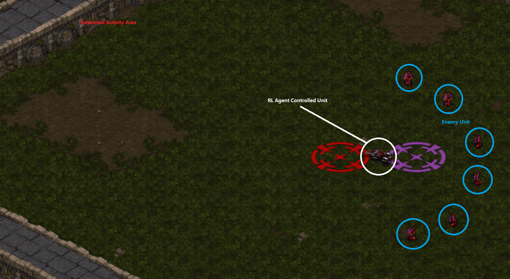

# StarCraft AI based on one step Q learning
This is a Java project that implements 1-step Q leanring on StarCraft BWAPI.
Imitate from paper “[Applying the Reinforcement Learning to Small Scale Combat in the Real-Time Strategy Game: Star Craft: Brood War](photos/starcraft_RL.pdf)”  

Training Evnironment  
[Training Video](photos/Training_Video.mp4) 
[ResultReport&Compare](photos/FinalReport.pdf) 
## Deployment
* First follow the instruction from the BWAPI Java version to install BWAPI 
* Start the game [StarCraft ](https://starcraft.com/en-us/?utm_source=Google%20US&utm_medium=Search&utm_content=22027804&utm_campaign=LQA_SCII_L_Remastered_Relaunch_Q2_2017_NA) with BWAPI deamon running 
* Create a customized map in StarCraft: BroodWar
* Enter the game and run java apllication provided here
Done!

## Built With

* [BWAPI](https://github.com/bwapi/bwapi) - The API Used to connect StarCraft

## Authors

* **Ang Li** - *Initial work* - [Ang Li](https://github.com/leonmz)

## Acknowledgments

* YunPeng Wu

